# CS 419 Ray Tracer
by Kevin Palani

## File List

- antialias: Defined antialiasing methods
- BVH: Methods to build a trace a bounding volume hierarchy
- camera: Defines a generic camera, with an ortho and perspective camera
- color: Generic color wrapper
- display: Methods to render to a PNG or to a window
- material: Represents a material, and defines a few types
- main: Sets up the scene and loops across all rays
- mesh: Methods to deal with groups of renderables. Can also load mesh from a simple obj file
- primitives: Render logic and AABB generation for primitives like triangles, planes, spheres, etc
- ray: Defines a ray for ray tracing
- renderable: Abstract class for things that can be rendered, along with what data a ray trace should return. Also defines AABBs
- renderer: Code to recursively render scene. Needs clean up
- vector: Custom vector math for 2d and 3d vectors

## MP3 Pictures

All 3 images were generated using Monte Carlo style ray tracing, with 64 samples per pixel, and a maximum
recursion depth of 2. The code is written in c++, and was benchmarked on a single core i7-10750H. The following
table shows the time taken for each render, as well as the total number of rays used

| Picture | Time    | Rays  |
| :---    | :---:   | :---: |
| Shadows       | 168.9 s | 62,067,687 |
| Transparent       | 337.8 s | 90,657,895 |
| Reflective       | 161.5 | 61,117,776 |

The first image consists of a few boxes. The main light source is a sphere in the back. There is
also a triangle at the top which acts as a mirror.  
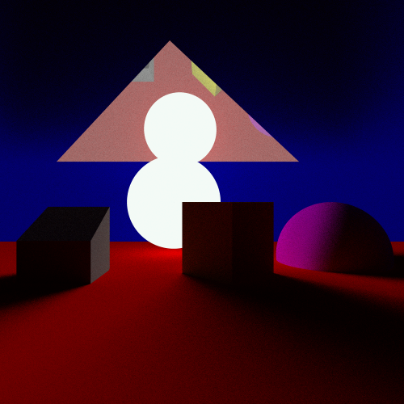  

The second image is similar to the first, except the light source is moves to be one of the boxes.
A transparent sphere is also added
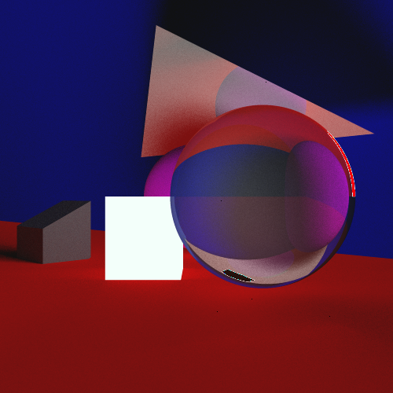  

The last image removes the transparent sphere, and makes everything reflective. The light source
is also moved to the triangle. A little more anti-aliasing rays are probably needed since the light
source is a bit further back, however I left it the same for consistent benchmarking.
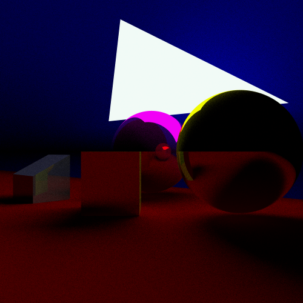;

## MP2 Pictures

To determine the effectiveness of the BVH, various numbers of spheres were rendered with and without
the BVH. This was run single threaded on an intel i7-10750H with no GPU optimizations. The BVH had a 
k=2, meaning leaf nodes on average had 2 elements in them. Spheres were rendered as fully reflective,
with a maximum recursion depth of 4. All spheres were fully opaque. No antialiasing was done. All images were rendered at 500 x 500.
Times are in seconds

| Spheres      | Time with BVH  | Time without BVH | Speedup |
| :---         |     :---:      |     :---:        | :---:   |
| 10	       | 0.331	        | 0.339	           | 1.024   |
| 100	       | 1.026	        | 3.165	           | 3.084   |
| 1,000	       | 5.037	        | 55.332	       | 10.985  |
| 10,000	   | 14.061	        | 677.023	       | 48.148  |
| 100,000	   | 31.053         | 6638.986         | 213.795 |
| 1,000,000	   | 78.64	        | NA               | NA      |

1,000 Spheres:  
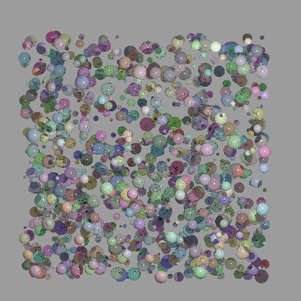  
10,000 Spheres:  
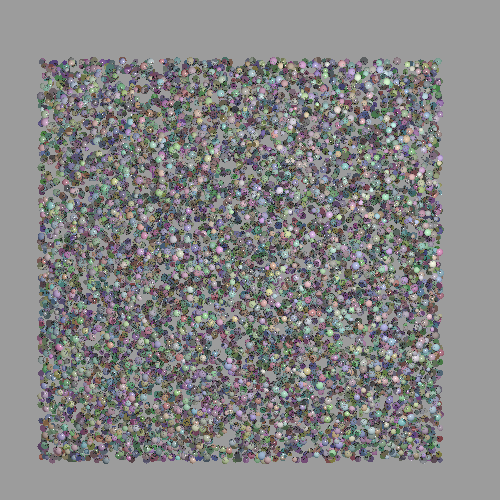  
100,000 Spheres:  
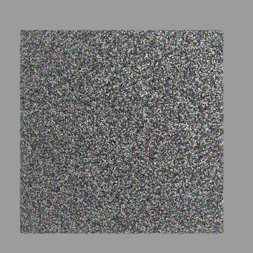  

Finally, a mesh with with 100,000 consisting of 50,000 vertices was rendered. 25 sub samples
were made per pixel, and there was a maximum reflection depth of 3.
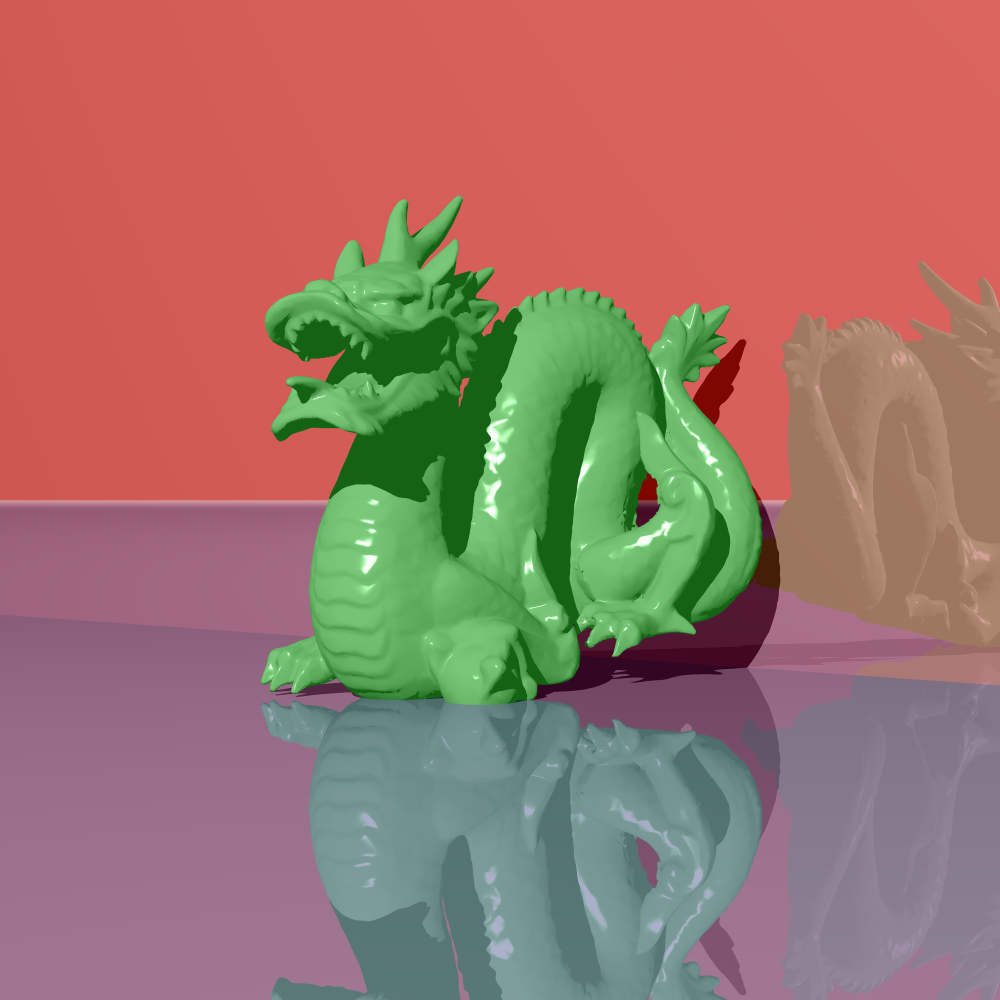

## MP1 Pictures
The scene is composed of:
- A solid pink sphere
- A solid grey prism
- A semitransparent yellow prism
- A slightly reflective blue floor plane
- A solid red background plane
- A fully reflective triangle

A perspective rendering on the scene:
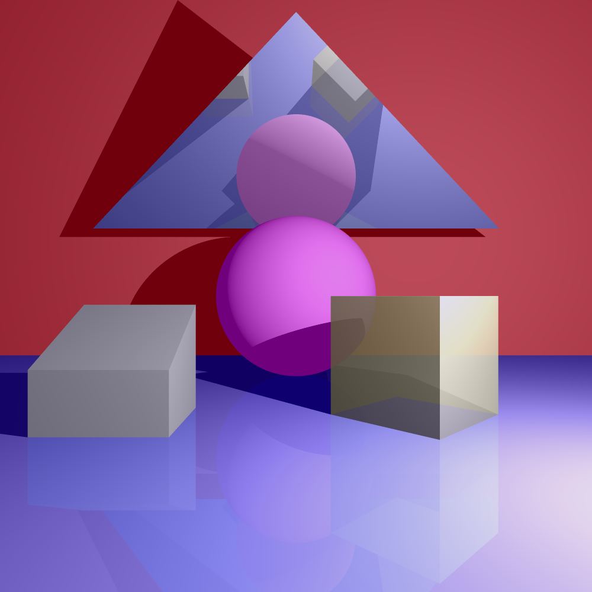

An orthographic rendering of the same scene. The camera is tilted slightly
downwards to be able to see the blue plane. Since the plane passes through
the viewplane, we are able to see underneath it.
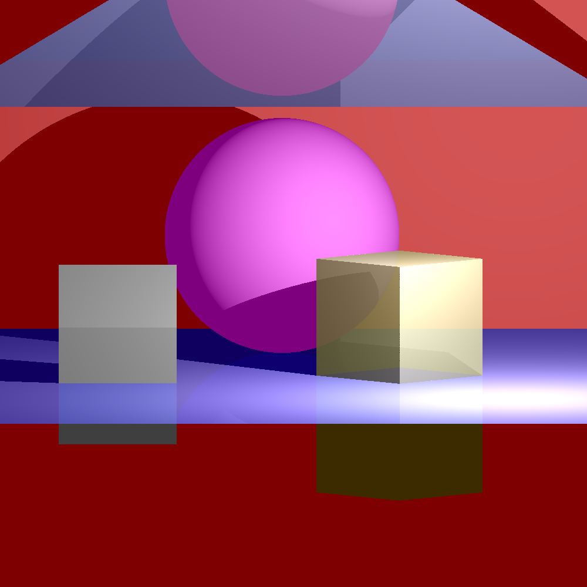

A perspective rendering of the same scene, except off to the right
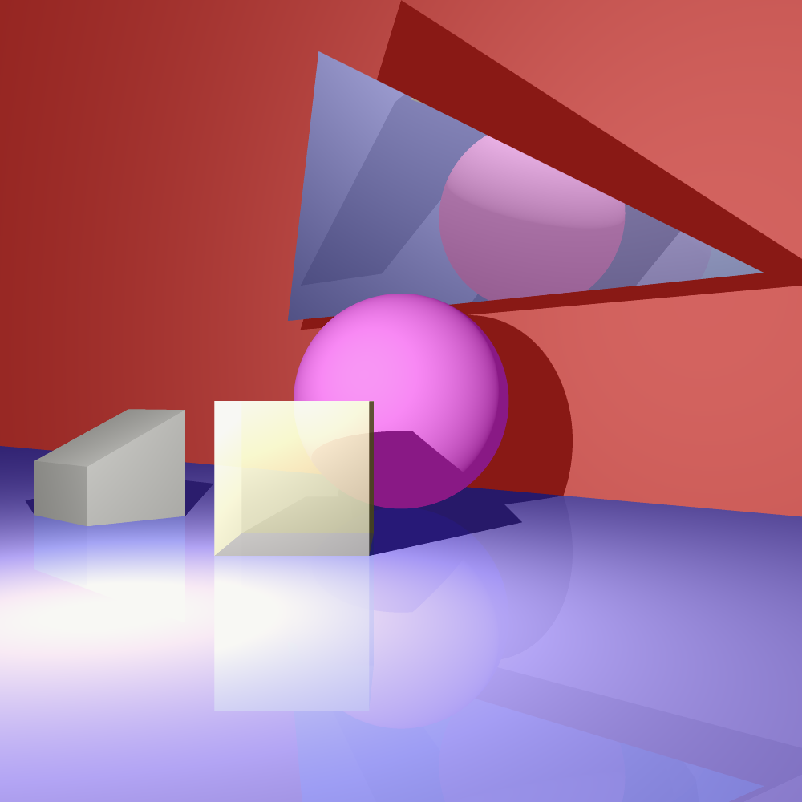

To show antialiasing, a zoomed in version of the scene at lower resolution
is rendered:
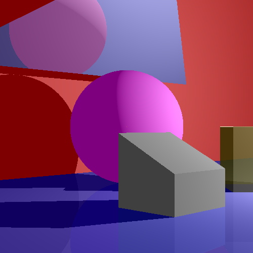

We can compare this to when antialiasing is enabled with a 4x4 course grid
and a 9x9 fine grid
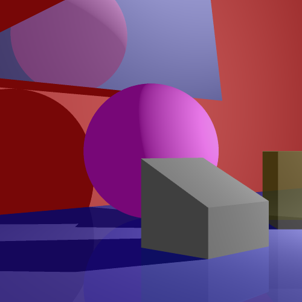

