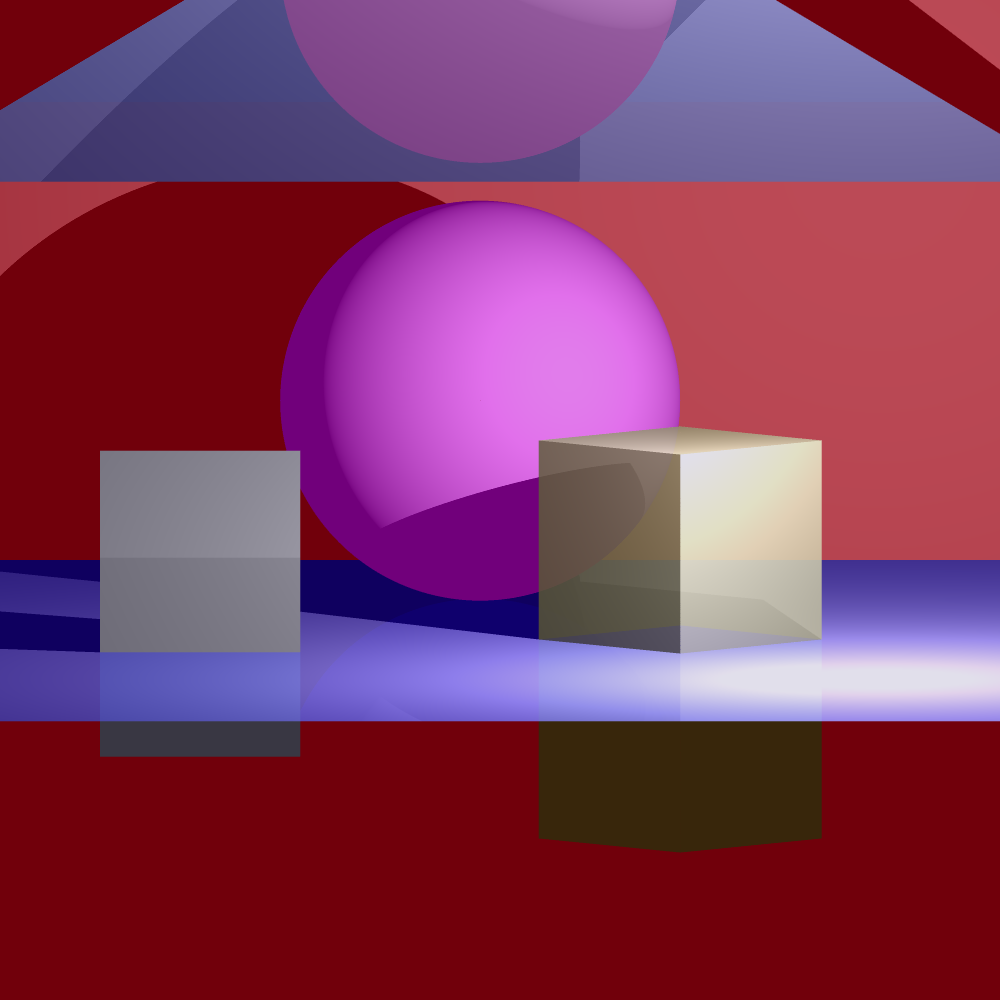

# CS 419 Ray Tracer
by Kevin Palani

## File List

- antialias: Defined antialiasing methods
- camera: Defines a generic camera, with an ortho and perspective camera
- color: Generic color wrapper
- display: Methods to render to a PNG or to a window
- material: Represents a material
- mesh: Methods to deal with groups of renderables
- primitives: Render logic for primitiaves like triangles, planes, spheres, etc
- ray: Defines a ray for ray tracing
- renderable: Abstract class for things that can be rendered, along with what data a raytrace should erturn
- renderer: WIP code to recursively render scene. Needs clean up
- vector: Custom vector math for 2d and 3d vectors

## MP1 Pictures
The scene is composed of:
- A solid pink sphere
- A solid grey prism
- A semitransparent yellow prism
- A slightly reflective blue floor plane
- A solid red background plane
- A fully reflective triangle

A perspective rendering on the scene:

An orthographic rendering of the same scene. The camera is tilted slightly
downwards to be able to see the blue plane. Since the plane passes through
the viewplane, we are able to see underneath it.

A perspective rendering of the same scene, except of to the right

To show antialiasing, a zoomed in version of the scene at lower resolution
is rendered:

We can compare this to we antialiasing is enabled:

